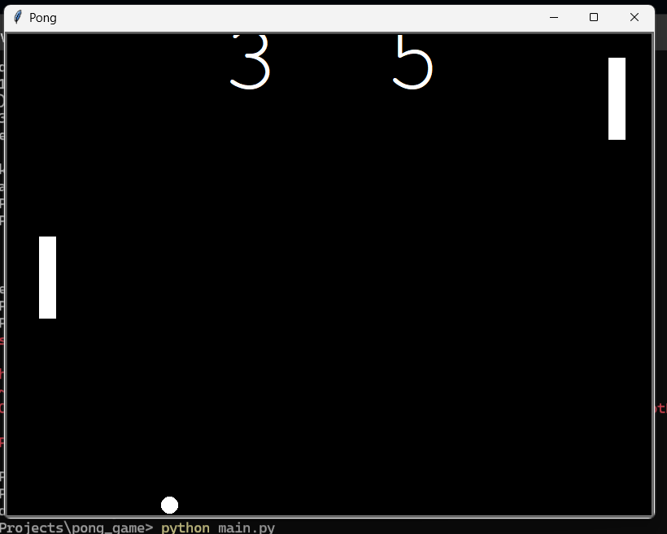

# 🕹️ Pong Game in Python (Turtle Graphics)


Welcome to a classic recreation of the **Pong** game using **Python's Turtle module**. This is a beginner-friendly project, great for mastering OOP and basic game logic!

---

## 📸 Game Preview

  


---

## 📂 Project Structure

```bash
pong_game/
│
├── main.py             # Game logic and main loop
├── paddle.py           # Paddle class and controls
├── ball.py             # Ball class and movement logic
├── scoreboard.py       # Score tracking and display
└── tempCodeRunnerFile.py (ignore)
